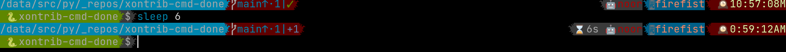
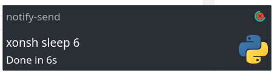

## Overview

<p align="center">
Send notification once long-running command is finished and also show the execution time..
</p>

## Installation

To install use pip:

``` bash
xpip install xontrib-cmd-durations
# or: xpip install -U git+https://github.com/jnoortheen/xontrib-cmd-durations
```

## Usage

Add the `long_cmd_duration` section to the [prompt fields](https://xon.sh/tutorial.html#customizing-the-prompt) and load the xontrib i.e.:

``` bash
$RIGHT_PROMPT = '{long_cmd_duration:⌛{}}{user:{{BOLD_RED}}🤖{}}{hostname:{{BOLD_#FA8072}}🖥{}}'
$XONTRIB_CD_LONG_DURATION = 5  # default
xontrib load cmd_done
```

If the command is taking more than `$XONTRIB_CD_LONG_DURATION` seconds then `long_cmd_duration` returns the duration in human readable way:



The desktop notification is sent if the terminal is not focused:



Currently the focusing part requires `xdotool` to be installed.

## Known issues

### notifications in Windows
On windows the notification will get triggered all the time. 
`Finding whether the terminal is focused` is not implemented for Windows yet and PRs are very welcome on that.
Set `$XONTRIB_CD_TRIGGER_NOTIFICATION = False` to completely off the notification part.


## Credits

This package was created with [xontrib cookiecutter template](https://github.com/jnoortheen/xontrib-cookiecutter).
